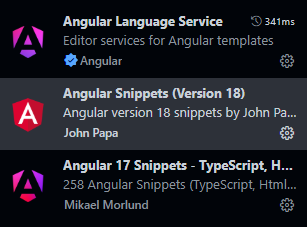
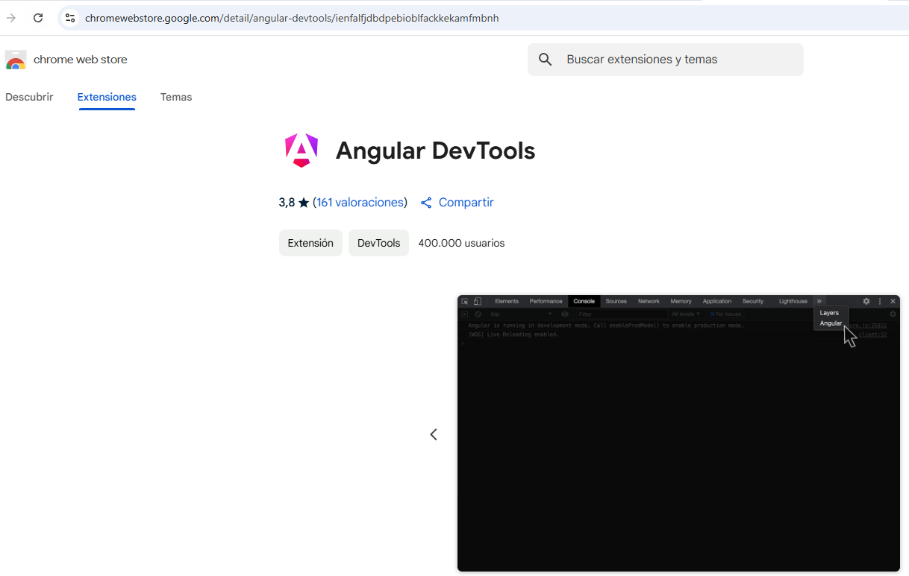

# AngularPro

This project was generated using [Angular CLI](https://github.com/angular/angular-cli) version 19.2.1.

## Development server

To start a local development server, run:

```bash
ng serve
```

Once the server is running, open your browser and navigate to `http://localhost:4200/`. The application will automatically reload whenever you modify any of the source files.

## Code scaffolding

Angular CLI includes powerful code scaffolding tools. To generate a new component, run:

```bash
ng generate component component-name
```

For a complete list of available schematics (such as `components`, `directives`, or `pipes`), run:

```bash
ng generate --help
```

## Building

To build the project run:

```bash
ng build
```

This will compile your project and store the build artifacts in the `dist/` directory. By default, the production build optimizes your application for performance and speed.

## Running unit tests

To execute unit tests with the [Karma](https://karma-runner.github.io) test runner, use the following command:

```bash
ng test
```

## Running end-to-end tests

For end-to-end (e2e) testing, run:

```bash
ng e2e
```

Angular CLI does not come with an end-to-end testing framework by default. You can choose one that suits your needs.

## Additional Resources

For more information on using the Angular CLI, including detailed command references, visit the [Angular CLI Overview and Command Reference](https://angular.dev/tools/cli) page.

PS C:\Users\Mañanas\curso MERN\Angular> ng new angular-pro --ssr false --style "css" --create-application false

$ ng g app demo --style "css" --ssr false -p cas -s-t --skip-install

$ npm i



Creación de 1 componente header
$ ng g c -b components/header

Angular Dev Tools


Directivas dinámicas de Angular

@for,@if,@case

Interpolación de contenidos -->{{expresión Javascript}}
Interpolación de atributos --> [atributo]="expresión Javascript"

svg como templates.

input y output (@input,@output) comunicación entre Padre e Hijo y viceversa. Modelos comunicación bidireccional (ngModel).

Comunicación mediante servicios.

La expresión if si no se cumple no carga el componente o el contenido del bloque.
@if (isEdit) {
<cas-edit>.....</cas-edit>
}

Ciclo de vida de componente angular (Crear el componente (Constructor), Visualizar (HTML),Inicialización (nginit)... )

Angular sigue un patrón de ciclo de vida basado en eventos, en el cual los componentes pasan por una serie de fases distintas. A continuación, se describen las principales fases y eventos de los ciclos de vida en Angular:

1- Construcción: Durante esta fase, se crea una instancia del componente. En esta etapa, Angular inicializa las propiedades del componente y resuelve las dependencias necesarias. El evento principal de esta fase es el constructor, donde se pueden inicializar variables y configurar el estado inicial del componente.
2- OnInit: Este evento ocurre justo después del constructor y se utiliza para realizar cualquier inicialización adicional que requiera el componente. Aquí es donde generalmente se realiza la lógica de inicialización que depende de las propiedades y dependencias del componente.
3- OnChanges: Este evento se dispara cuando las propiedades de entrada (input) del componente cambian. Angular verifica si las propiedades de entrada han cambiado y, de ser así, ejecuta el código correspondiente. Este evento es útil para detectar cambios y tomar acciones en consecuencia.
4- AfterContentInit: Este evento se desencadena una vez que Angular ha inicializado el contenido proyectado dentro del componente. Puede ser útil cuando se trabaja con componentes hijos o cuando se necesita acceder a elementos del DOM dentro del componente.
5- AfterViewInit: En esta fase, Angular ha inicializado las vistas del componente y las ha renderizado en el DOM. El evento AfterViewInit se activa cuando la vista del componente está lista y se pueden realizar operaciones adicionales, como manipular el DOM o configurar componentes secundarios.
6- OnDestroy: Este evento se desencadena justo antes de que el componente sea destruido y eliminado del DOM. Se utiliza para liberar recursos, cancelar suscripciones y realizar otras tareas de limpieza necesarias para evitar posibles fugas de memoria.

rxjs

https://reactivex.io/
